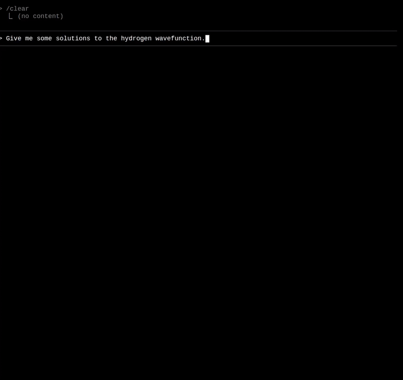

  

  Display beautiful mathematical equations directly in your obsidian terminal

  

## Obsidian LaTerM Plugin

This is a fork of [obsidian-terminal v3.17.0](https://github.com/polyipseity/obsidian-terminal) that integrates [LaTerM](https://github.com/MaxwellsEquation/LaTerM) for LaTeX rendering in terminals.

While I wait for Obsidian to approve this plugin for listing on the plugin browser, you can manually install it
using the same manual install directions as specified in the obsidian terminal readme.

### Features

- All the features of obsidian-terminal
- LaTeX rendering using LaTerM
- Inline math with `$...$`
- Display math with `$$...$$`

### Installation

Install from Obsidian community plugins or download the latest release.

### Credits

- Original terminal plugin: [obsidian-terminal](https://github.com/polyipseity/obsidian-terminal) by polyipseity
- LaTeX rendering: [LaTerM](https://github.com/MaxwellsEquation/LaTerM)